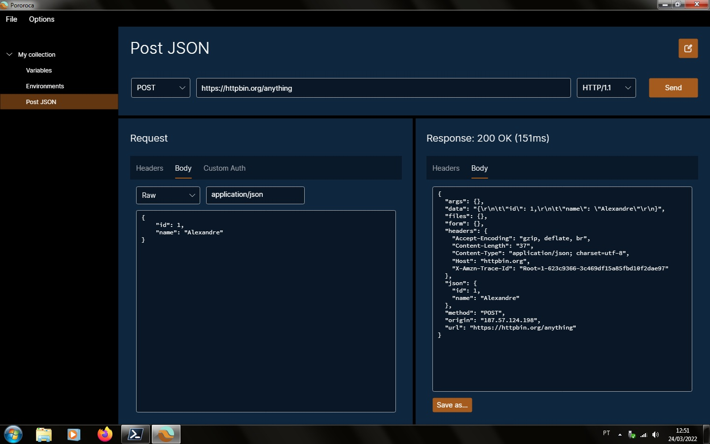

 <h1>Pororoca </h1>

[Ler em português](README_pt.md)

Pororoca is a HTTP testing tool, inspired on Postman, but with many improvements.

## Installation

Read the [instructions](./docs/en-GB/Installation.md) and download the program [here](https://github.com/alexandrehtrb/Pororoca/releases).

## Features

* Support for [HTTP/2](https://http2.github.io/) and [HTTP/3](https://developers.cloudflare.com/http3/).
* Collection-scoped environments.
* Easy variable management.
* Secret variables.
* Collections and environments can be exported together in a single file.
* Full export and import compatibility with Postman.
* Much lower memory usage - around six times less than Postman.
* Fast startup time.
* Open-source.

*Note*: Support for HTTP/2 requires Linux or Windows 10 and later, and support for HTTP/3 requires Linux or Windows 11 and later.

### HTTP/3 and traceability

HTTP/3 uses the QUIC transport protocol and there are some traceability concerns about it. It might not be a problem on internal network communications and for most business applications, though. There is an interesting article about it [here](https://svs.informatik.uni-hamburg.de/publications/2019/2019-02-26-Sy-PET_Symposium-A_QUIC_Look_at_Web_Tracking.pdf).

## Contributing

You can contribute to this project by submitting pull requests, opening issues, reporting bugs and suggesting improvements. Tell about Pororoca to your friends if you like it!

Pororoca is free and its use is governed by a GPLv3 licence. We accept money donations - if you are interested in donating, please contact us.

Also contact us if you are looking for more advanced support, special customizations or training.

## Design

Logo created by [Anderson Martins](https://www.behance.net/am-dsgn).