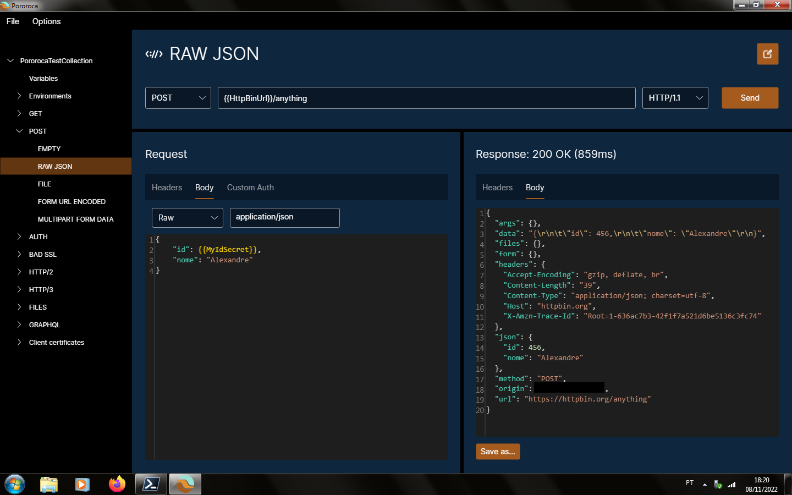

 <h1>Pororoca </h1>

[Ler em português](README_pt.md) | [Читать на русском](README_ru.md)

Pororoca is a HTTP testing tool, inspired by Postman, but with many improvements.

It is available for Windows, Mac OSX and Linux.

## Installation

Read the [instructions](https://pororoca.io/docs/installation) and download the program [here](https://github.com/alexandrehtrb/Pororoca/releases).

## Features

* Support for [HTTP/2](https://http2.github.io/) and [HTTP/3](https://developers.cloudflare.com/http3/).
* Collection-scoped environments.
* Easy variable management.
* Secret variables.
* Collections and environments can be exported together in a single file.
* Full export and import compatibility with Postman.
* Much lower memory usage - two to three times less than Postman.
* Multilanguage support.
* Automated testing.
* WebSockets.
* Fast startup time.
* Free and open-source.

Check the [documentation](https://pororoca.io/docs/) to know more.

*Note*: On Windows, support for HTTP/2 requires Windows 10 or later. Support for HTTP/3 requires Linux or Windows 11 and later.

### HTTP/3 and privacy

HTTP/3 uses the QUIC transport protocol and there are some privacy concerns about it. It might not be a problem on internal network communications and for most business applications, though. There is an interesting article about it [here](https://svs.informatik.uni-hamburg.de/publications/2019/2019-02-26-Sy-PET_Symposium-A_QUIC_Look_at_Web_Tracking.pdf).

## Data protection policy

Pororoca does not sync user data, such as preferences, collections, environments, machine info or telemetry, to any remote server. User preferences and collections are saved as files in the user machine.

## Design

Logo and art created by [Anderson Martins](https://www.behance.net/am-dsgn).

## Contributing

You can contribute to this project by submitting pull requests, opening issues, reporting bugs and suggesting improvements. Tell about Pororoca to your friends if you like it!

Read the tutorial for code contributions [here](CONTRIBUTING.md).

Contact us if you are looking for more advanced support, special customizations or training.

## Donations

You can also contribute with money donations.

|  |  |
|--|--|
| [View QR Code](./misc/pix_doacao_qr_code.png) | [View QR Code](./misc/paypal_donation_qr_code.png) |

## Contact

* Creator: Alexandre H. T. R. Bonfitto
* E-mail: alexandrehtrb@outlook.com