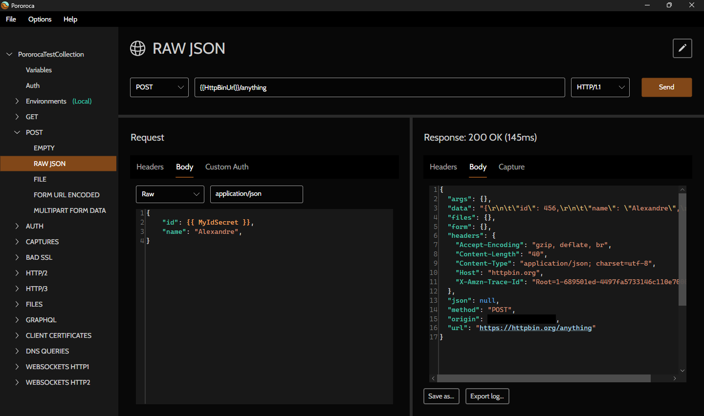

<h1>Pororoca </h1>

Czytaj w: [english](README.md) | [português](README_pt.md) | [русском](README_ru.md) | [italiano](README_it.md) | [中文](README_zh-cn.md) | [Deutsch](README_de.md) | [español](README_es.md)

Pororoca to narzędzie do testowania HTTP, inspirowane Postmanem, ale z wieloma ulepszeniami.

Jest dostępne dla Windows, macOS i Linux.

## Instalacja

Przeczytaj [instrukcje](https://pororoca.io/docs/installation) i pobierz program [tutaj](https://github.com/alexandrehtrb/Pororoca/releases).

## Funkcje

* Wsparcie dla [HTTP/2](https://http2.github.io/) i [HTTP/3](https://developers.cloudflare.com/http3/).
* Środowiska w zakresie kolekcji.
* Łatwe zarządzanie zmiennymi.
* Zmienne tajne.
* Kolekcje i środowiska mogą być eksportowane razem w jednym pliku.
* Pełna kompatybilność eksportu i importu z Postmanem.
* Znacznie niższe zużycie pamięci - dwa do trzech razy mniej niż Postman.
* Wsparcie wielojęzyczne.
* Automatyczne testowanie.
* WebSockets.
* Szybki czas uruchamiania.
* Darmowe i open-source.

Sprawdź [dokumentację](https://pororoca.io/docs/), aby dowiedzieć się więcej.

*Uwaga*: W systemie Windows wsparcie dla HTTP/2 wymaga Windows 10 lub nowszego. Wsparcie dla HTTP/3 wymaga Linux lub Windows 11 i nowszych.

### HTTP/2 i HTTP/3

Chcesz dowiedzieć się więcej o HTTP/2 i HTTP/3? Sprawdź ten [artykuł](https://alexandrehtrb.github.io/posts/2024/03/http2-and-http3-explained/).

## Polityka ochrony danych

Pororoca nie synchronizuje danych użytkownika, takich jak preferencje, kolekcje, środowiska, informacje o maszynie czy telemetria, z żadnym zdalnym serwerem. Preferencje użytkownika i kolekcje są zapisywane jako pliki na komputerze użytkownika.

## Design

Logo i grafika stworzone przez [Anderson Martins](https://www.behance.net/am-dsgn).

## Współtworzenie

Możesz przyczynić się do tego projektu poprzez przesyłanie pull requestów, otwieranie zgłoszeń, raportowanie błędów i sugerowanie ulepszeń. Opowiedz o Pororoca swoim znajomym, jeśli ci się podoba!

Przeczytaj samouczek dotyczący wkładu w kod i rozwój [tutaj](CONTRIBUTING.md).

Skontaktuj się z nami, jeśli szukasz bardziej zaawansowanego wsparcia, specjalnych dostosowań lub szkolenia.

## Darowizny

Darowizny pieniężne są bardzo ważne i pomagają nam pokryć nasze wydatki. Przeczytaj więcej w naszym [ogłoszeniu](https://github.com/alexandrehtrb/Pororoca/discussions/159)!

Nasze kanały darowizn to:

- [OpenCollective](https://opencollective.com/pororoca)
- [GitHub Sponsors](https://github.com/sponsors/alexandrehtrb)
- [Wise](https://wise.com/pay/me/alexandrehenriquet2) (tag: **@alexandrehenriquet2**)
- PIX 🇧🇷 (chave: alexandrehtrb@outlook.com)

## Kontakt

* Twórca: Alexandre H. T. R. Bonfitto
* E-mail: alexandrehtrb@outlook.com
