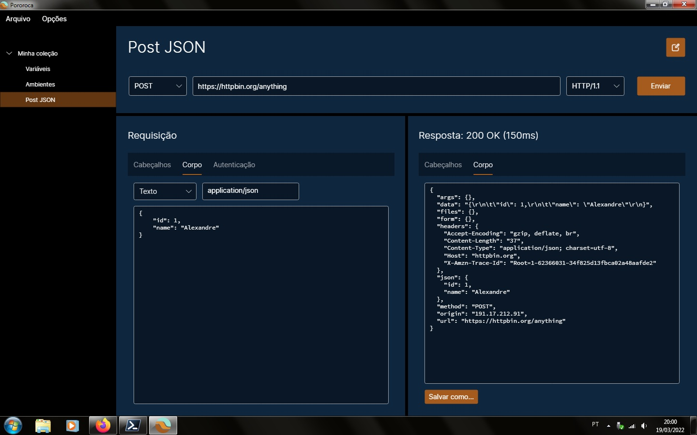

 <h1>Pororoca </h1>

[Read in english](README.md)

Pororoca é uma ferramenta de testes de HTTP, como o Postman, mas com diversas melhorias.

Está disponível para Windows, Mac OSX e Linux.

## Instalação

Leia as [instruções](./docs/pt-BR/Instalação.md) e baixe o programa [aqui](https://github.com/alexandrehtrb/Pororoca/releases).

## Funcionalidades

* Suporte a [HTTP/2](https://http2.github.io/) e [HTTP/3](https://developers.cloudflare.com/http3/).
* Ambientes dentro de coleções.
* Gerenciamento fácil de variáveis.
* Variáveis secretas.
* Coleções e ambientes podem ser exportados juntos em um mesmo arquivo.
* Compatibilidade total com o Postman ao importar ou exportar.
* Consumo muito menor de memória - cerca de seis vezes menos do que o Postman.
* Inicialização rápida.
* Código-aberto.

Confira a [documentação](./docs/pt-BR/PáginaInicial.md) para saber mais.

*Nota*: Suporte ao HTTP/2 requer Linux ou Windows 10 e acima, e suporte ao HTTP/3 requer de Linux ou Windows 11 e acima.

### HTTP/3 e rastreamento

HTTP/3 usa o protocolo de transporte QUIC e há algumas preocupações de rastreabilidade quanto a este. Isso não é um problema para comunicações em redes internas e para a maioria das aplicações de negócios, contudo. Há um [artigo](https://svs.informatik.uni-hamburg.de/publications/2019/2019-02-26-Sy-PET_Symposium-A_QUIC_Look_at_Web_Tracking.pdf) interessante sobre isso que vale a pena ler.

## Contribuindo

Você pode contribuir com esse projeto através de pull requests, abrindo issues, reportando bugs e sugerindo melhorias. Divulgue o Pororoca para seus amigos se você gostar dele!

O Pororoca é gratuito e regido pela licença GPLv3. Nós aceitamos doações em dinheiro - se estiver interessado em doar, por favor, contacte-nos.

Também entre em contato se desejar suporte mais avançado, customizações especiais ou treinamentos.

## Design

Logo criado por [Anderson Martins](https://www.behance.net/am-dsgn).