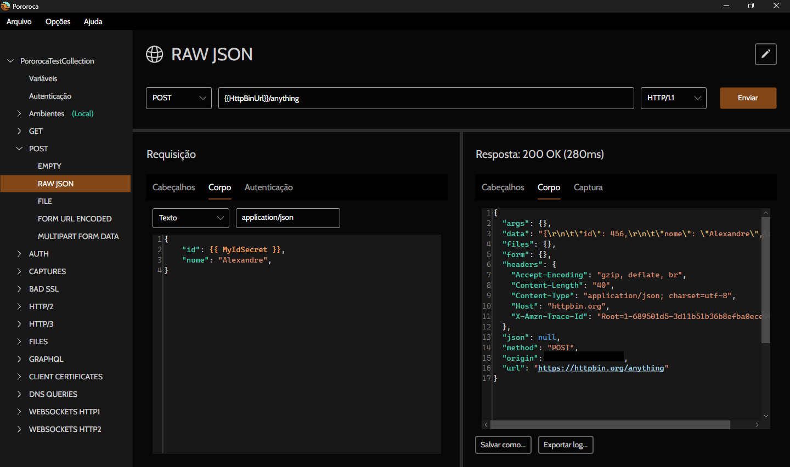

 <h1>Pororoca </h1>

[Read in english](README.md)

Pororoca é uma ferramenta de testes de HTTP, como o Postman, mas com diversas melhorias.

Está disponível para Windows, Mac OSX e Linux.

## Instalação

Leia as [instruções](https://pororoca.pages.dev/pt/docs/installation) e baixe o programa [aqui](https://github.com/alexandrehtrb/Pororoca/releases).

## Funcionalidades

* Suporte a [HTTP/2](https://http2.github.io/) e [HTTP/3](https://developers.cloudflare.com/http3/).
* Ambientes dentro de coleções.
* Gerenciamento fácil de variáveis.
* Variáveis secretas.
* Coleções e ambientes podem ser exportados juntos em um mesmo arquivo.
* Compatibilidade total com o Postman ao importar ou exportar.
* Consumo muito menor de memória - cerca de cinco vezes menos do que o Postman.
* Testes automatizados.
* WebSockets.
* Inicialização rápida.
* Gratuito e código-aberto.

Confira a [documentação](.https://pororoca.pages.dev/pt/docs/) para saber mais.

*Nota*: No Windows, suporte ao HTTP/2 requer Windows 10 ou acima. Suporte ao HTTP/3 requer Linux ou Windows 11 e acima. HTTP/3 está em fase experimental.

### HTTP/3 e privacidade

HTTP/3 usa o protocolo de transporte QUIC e há algumas preocupações de privacidade quanto a este. Isso não é um problema para comunicações em redes internas e para a maioria das aplicações de negócios, contudo. Há um [artigo](https://svs.informatik.uni-hamburg.de/publications/2019/2019-02-26-Sy-PET_Symposium-A_QUIC_Look_at_Web_Tracking.pdf) interessante sobre isso que vale a pena ler.

## Design

Logo e arte criados por [Anderson Martins](https://www.behance.net/am-dsgn).

## Contribuindo

Você pode contribuir com esse projeto através de pull requests, abrindo issues, reportando bugs e sugerindo melhorias. Divulgue o Pororoca para seus amigos se você gostar dele!

Entre em contato se desejar suporte mais avançado, customizações especiais ou treinamentos.

## Doações

Você também pode contribuir com doações em dinheiro.

Chave PIX: alexandrehtrb@outlook.com

|  |  |
|--|--|
| [Ver QR Code](./misc/pix_doacao_qr_code.png) | [Ver QR Code](./misc/paypal_donation_qr_code.png) |