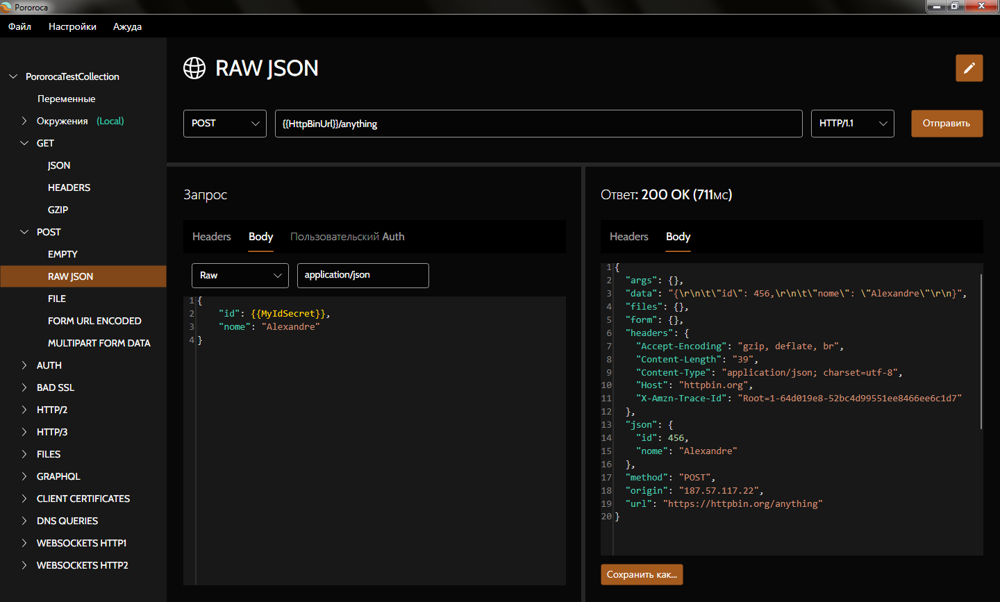

 <h1>Pororoca </h1>

[Read in english](README.md) | [Ler em português](README_pt.md)

Pororoca - это инструмент тестирования HTTP, вдохновленный Postman, но со многими улучшениями.

Он доступен для Windows, Mac OSX и Linux.

## Установка

Прочитайте [инструкции](https://pororoca.io/docs/installation) и скачайте программу [здесь](https://github.com/alexandrehtrb/Pororoca/releases).

## Возможности

* Поддержка для [HTTP/2](https://http2.github.io/) и [HTTP/3](https://developers.cloudflare.com/http3/).
* Коллекции включают в себя окружения.
* Простое управление переменными.
* Секретные переменные.
* Коллекции и окружения могут быть экспортированы вместе в одном файле.
* Полная совместимость с Postman при экспорте и импорте.
* Гораздо меньшее использование памяти - в два-три раза меньше, чем у Postman.
* Поддержка нескольких языков.
* Автоматизированное тестирование.
* WebSockets.
* Быстрое время запуска.
* Бесплатный и с открытым исходным кодом.

Посмотрите [документацию](https://pororoca.io/docs/) чтобы узнать больше.

*Примечание*: В Windows для поддержки HTTP/2 требуется Windows 10 и более поздняя. Для поддержки HTTP/3 требуется Linux или Windows 11 и более поздняя.

### HTTP/3 и конфиденциальность

HTTP/3 использует транспортный протокол QUIC и по этому поводу есть некоторые опасения по поводу конфиденциальности. Однако это может не представлять проблемы при внутренней сетевой коммуникации и для большинства бизнес-приложений. Об этом есть интересная статья [здесь](https://svs.informatik.uni-hamburg.de/publications/2019/2019-02-26-Sy-PET_Symposium-A_QUIC_Look_at_Web_Tracking.pdf).

## Политика защиты данных

Pororoca не синхронизирует пользовательские данные, такие как настройки, коллекции, среды, информацию о компьютере или телеметрию, с каким-либо удаленным сервером. Пользовательские настройки и коллекции сохраняются в виде файлов на компьютере пользователя.

## Дизайн

Логотип и художественное оформление созданны [Anderson Martins](https://www.behance.net/am-dsgn).

## Вклад

Вы можете внести свой вклад в этот проект, отправляя запросы на извлечение, открывая проблемы, сообщая об ошибках и предлагая улучшения. Расскажите о Pororoca своим друзьям, если вам это нравится!

Прочтите руководство по вкладу кода [здесь](CONTRIBUTING.md).

Свяжитесь с нами, если вам нужна более продвинутая поддержка, специальные настройки или обучение.

## Пожертвования

Вы также можете внести свой вклад денежными пожертвованиями.

|  |  |
|--|--|
| [View QR Code](./misc/pix_doacao_qr_code.png) | [View QR Code](./misc/paypal_donation_qr_code.png) |

## Контактная информация

* Создатель: Alexandre H. T. R. Bonfitto
* E-mail: alexandrehtrb@outlook.com