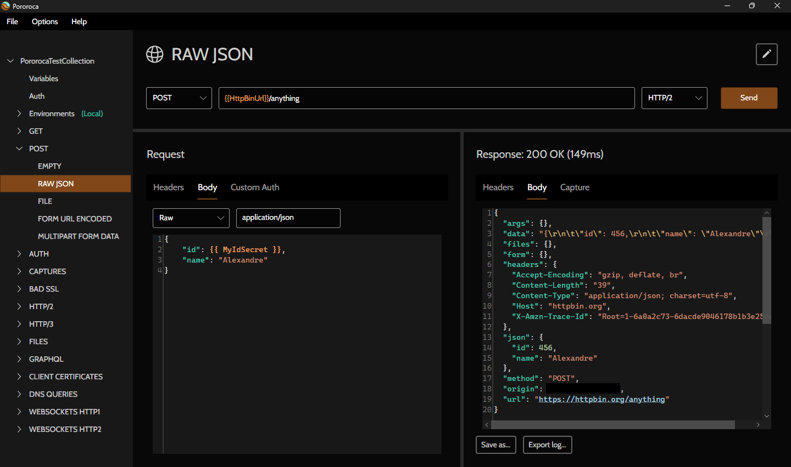

<h1>Pororoca </h1>

Читайте мовою: [English](README.md) | [português](README_pt.md) | [русском](README_ru.md) | [italiano](README_it.md) | [中文](README_zh-cn.md) | [Deutsch](README_de.md) | [español](README_es.md) | [polski](README_pl.md) | [ไทย](README_th.md) | [Türkçe](README_tr.md) | [Українська](README_ua.md)

Pororoca — це інструмент для тестування HTTP, натхненний Postman, але з багатьма покращеннями.

Він доступний для Windows, macOS та Linux.

## Встановлення

Прочитайте [інструкції](https://pororoca.io/docs/installation) та завантажте програму [тут](https://github.com/alexandrehtrb/Pororoca/releases).

## Можливості

* Підтримка [HTTP/2](https://http2.github.io/) та [HTTP/3](https://developers.cloudflare.com/http3/).
* Середовища на рівні колекції.
* Зручне керування змінними.
* Секретні змінні.
* Колекції та середовища можна експортувати разом в одному файлі.
* Повна сумісність експорту та імпорту з Postman.
* Значно менше споживання пам'яті — у два-три рази менше, ніж у Postman.
* Підтримка багатьох мов.
* WebSocket поверх HTTP/1.1 та HTTP/2.
* Автоматизоване тестування.
* Швидкий запуск.
* Безкоштовний і з відкритим кодом.

Щоб дізнатися більше, ознайомтеся з [документацією](https://pororoca.io/docs/).

*Примітка*: у Windows підтримка HTTP/2 потребує Windows 10 або новішої версії. Підтримка HTTP/3 потребує Linux або Windows 11 і новіших.

### HTTP/2 та HTTP/3

Хочете більше дізнатися про HTTP/2 та HTTP/3? Прочитайте цю [статтю](https://alexandrehtrb.github.io/posts/2024/03/http2-and-http3-explained/).

## Політика захисту даних

Pororoca не синхронізує дані користувача, такі як налаштування, колекції, середовища, інформація про пристрій чи телеметрія, з жодним віддаленим сервером. Налаштування та колекції користувача зберігаються у вигляді файлів на його пристрої.

Наш застосунок [відповідає вимогам HIPAA](https://www.stedi.com/blog/postman-is-probably-not-hipaa-compliant).

## Дизайн

Логотип і графіку створив [Anderson Martins](https://www.behance.net/am-dsgn).

## Участь у проєкті

Ви можете долучитися до проєкту, надсилаючи pull request-и, створюючи issues, повідомляючи про помилки та пропонуючи покращення. Розкажіть про Pororoca друзям, якщо він вам сподобався!

Прочитайте посібник з внесення змін до коду та розробки [тут](CONTRIBUTING.md).

Зв'яжіться з нами, якщо вам потрібна розширена підтримка, особливі доопрацювання чи навчання.

## Пожертви

Грошові пожертви допомагають нам продовжувати розробку проєкту та покривати витрати. Докладніше читайте в нашому [оголошенні](https://github.com/alexandrehtrb/Pororoca/discussions/159)!

Наші канали для пожертв:

- [OpenCollective](https://opencollective.com/pororoca)
- [GitHub Sponsors](https://github.com/sponsors/alexandrehtrb)
- [Wise](https://wise.com/pay/me/alexandrehenriquet2) (тег: **@alexandrehenriquet2**)
- PIX 🇧🇷 (ключ: <b>alexandrehtrb@outlook.com</b>)

## Контакти

* Автор: Alexandre H. T. R. Bonfitto
* E-mail: <a href="mailto:%61%6C%65%78%61%6E%64%72%65%68%74%72%62%40%6F%75%74%6C%6F%6F%6B%2E%63%6F%6D" target="_blank" rel="noreferrer">alexandrehtrb@outlook.com</a>