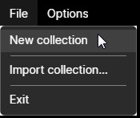
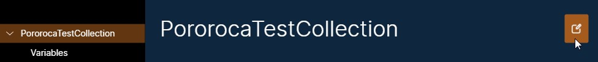

# Collections

A Pororoca collection holds your collection variables, environments and HTTP requests, all together in a single place.

## Creating

To create a new collection, go to the top menu, select "File", then "New collection". Your new collection will be visible on the left panel. You can create as many collections as you want.

## Renaming

To rename your collection, click on the collection in the left panel, then, on the main screen, click on the pencil icon, at the top right. This will enable the collection name for edition. After changing, click on the check icon to apply the new name.

## Import and export

Collections can also be imported and exported from files. Check the [Export and Import](ExportAndImport.md) page.

## Saved location

The collections that you create are saved in the `PororocaUserData` folder, located along the executable. When you close the application, all collections are saved.