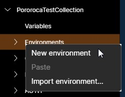
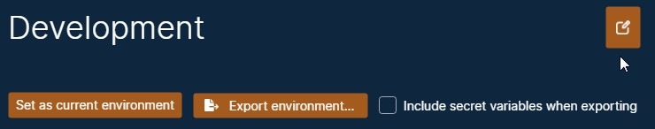
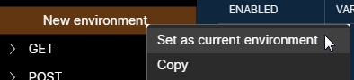

# Environments

An environment is a group of [variables](Variables.md).

The term environment comes from the fact that most Web services are replicated across different environments, such as a Local environment, for an application running in the same machine; a Development environment, used by developers; a QA environment, used by testers; a Homologation environment, for third-party testing; and finally, the Production environment, that end customers use, and, therefore, is the one that needs most caution when using it or making changes.

This example of a set of environments is quite common in major systems and allows better independence and safety - a new version of an API can be deployed firstly on a Development environment and be tested there; if a bug or a malfunction is detected in this new version, it will not affect the end customers, because this new version was not deployed to their Web server, the Production environment. More information on this topic [here](https://en.wikipedia.org/wiki/Deployment_environment).

Environments are not obligatory to make requests. However, they can be very helpful for management and for testing.

## Creating

To create an environment, expand the collection in the left panel, then right-click on the "Environments" and select "New environment". Your new environment will be inside the "Environments" item. You can create as many environments as you want.

## Renaming

To rename your environment, click on the environment in the left panel, then, on the main screen, click on the pencil icon, at the top right. This will enable the environment name for edition. After changing, click on the check icon to apply the new name.

## Import and export

Environments can be imported and exported from / to files. Check on the [Export and Import](ExportAndImport.md) page.

## Enabling the environment

Only one environment can be active in a collection, and only when an environment is active, its variables will be available to be applied. To set an environment as active, right-click on the environment in the left panel and select "Set as current environment".

## Comparison with Postman environments

Postman also has environments, which also are groups of variables. The main difference is that a Postman environment is globally-scoped, with its variables being applied on all collections. On Pororoca, an environment is collection-scoped, to export it together with the collection and to not have the risk of using an environment in the wrong place.