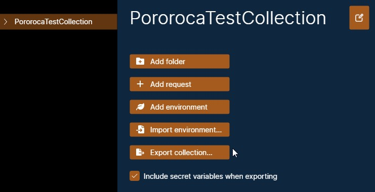
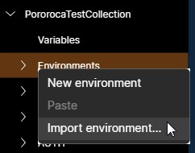

# Export and Import

Collections and environments can be exported or imported from / to files, that can be saved and shared with other people.

Pororoca offers full export and import compatibility with Postman.

## Export

To export a collection or an environment, click on them in the left panel, then click on one of the "Export as..." buttons, depending of which file format you choose.

The "Include secret variables" option, if selected, will include the values of secret variables in the exported files. If not selected, the values of secret variables will be replaced by a blank text.

When exporting a collection in the Pororoca format, the collection's environments will also be carried in the file - there is no need to export each environment individually.

The exported files are JSON text files, that you can inspect and edit on a text editor of your choice.

## Import

### Collection

To import a collection, go to the top menu, select "File", then "Import collection..." option. A select file dialog will open.

*Note*: Postman requests that have file parameters use a different file path scheme than Pororoca. After importing, make sure the file paths are correct, for example, in requests' bodies.

### Environment

To import an environment, expand your collection on the left panel and right-click on the "Environments" item. Then, "Import environment..." option. A select file dialog will open.

