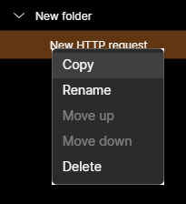
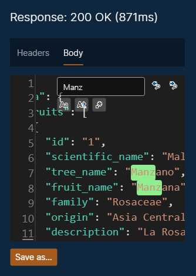
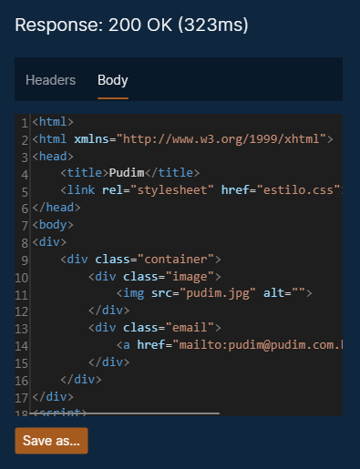
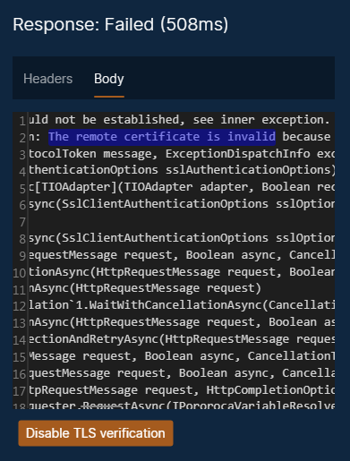

# Requests

* [General aspects](#general-aspects)
* [Creating](#creating)
* [Renaming](#renaming)
* [Copying, pasting and deleting](#copying-pasting-and-deleting)
* [Custom auth](#custom-auth)
    * [Basic auth](#basic-authentication)
    * [Bearer auth](#bearer-authentication)
    * [Client certificate auth](#client-certificate-authentication)
* [Sending a request](#sending-a-request)
    * [Searching and zooming text](#searching-and-zooming-text)
    * [Saving a response](#saving-a-response)
* [TLS / SSL server certificate verification](#tls--ssl-server-certificate-verification)

## General aspects

A HTTP request is composed by:
* HTTP method / verb
* Request URL
* HTTP version
* Headers (optional)
* Body (optional)
  
A HTTP response contains:
* HTTP version
* HTTP response status code
* Headers (optional)
* Body (optional)

## Creating

To create a new request, click on a collection or folder and select "New HTTP request". You can also do that clicking with your mouse's right button.

## Renaming

To rename your request, click on the pencil icon, at the top right. This will enable the request name for edition.

## Copying, pasting and deleting

To copy, paste or delete a request, right-click on it in the left panel.

You can select more than one request or folder at the same time and copy or delete them together.

## Custom auth

Custom auth enables you to set authentication parameters, instead of typing an Authorization header manually. Three types of authentication are supported: Basic, Bearer and Client certificate.

### Basic authentication

If Basic authentication is used, with a login "usr" and a password "pwd", the following Authorization header will be added when sending the request, according to [Basic authentication logic](https://browse-tutorials.com/tools/basic-auth):

`Authorization: Basic dXNyOnB3ZA==`

### Bearer authentication

If Bearer authentication is used, with a bearer token "my_token", then the following Authorization header will be added when sending the request:

`Authorization: Bearer my_token`

### Client certificate authentication

Client certificate authentication differs from the methods above because it operates on TLS layer, before the HTTP request is transmitted.

The two accepted client certificate types are PKCS#12 and PEM. This [page](https://www.ryadel.com/en/ssl-certificates-standards-formats-extensions-cer-crt-key-pfx-pem-p7b-p7c-pfx-p12/?msclkid=ca7bc065ae0311ec98e66e2041811628) details some of the certificate types that exist.

## Sending a request

To send a request, click on the button "Send", at the top right of the screen. You can abort the request by clicking on the "Cancel" button. The timeout period is 5 minutes.

### Searching and zooming text

In the text editors, you can search words by pressing `Ctrl+F`.

By scrolling the mouse wheel up and down, you can increase or decrease the font size.

### Saving a response

You can save the response body to a file, by clicking on the "Save as..." button.

## TLS / SSL server certificate verification

By default, Pororoca verifies server SSL / TLS certificates on HTTPS connections, and if there are any validation failures, the request will not go forward, like in the picture below.

To disable server TLS certificate check, click on the button on the bottom, or go to the top menu, "Options", and select "Disable TLS verification".

