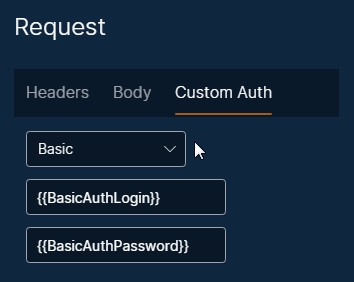
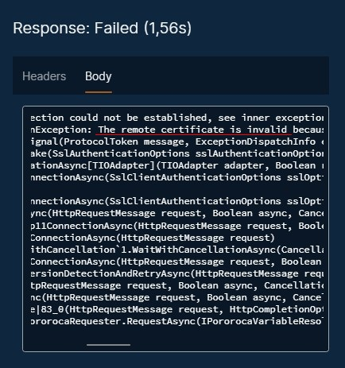
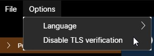

# Requests

A HTTP request is composed by:
* HTTP method / verb
* Request URL
* HTTP version
* Headers (optional)
* Body (optional)
  
A HTTP response contains:
* HTTP version
* HTTP response status code
* Headers (optional)
* Body (optional)

## Creating

To create a new request, you can right-click on a collection or folder and select "New request". The new request will be visible and you can create as many requests as you want.

## Renaming

To rename your request, click on the request in the left panel, then, on the main screen, click on the pencil icon, at the top right. This will enable the request name for edition. After changing, click on the check icon to apply the new name.

## Copying, pasting and deleting

To copy a request, right-click on it in the left panel and select "Copy". Then, right-click on a collection or folder and select "Paste".

To delete a request, right-click on it, "Delete".

"Move Up" and "Move Down" change the order of requests inside a collection or folder. 

## Custom auth

Custom auth enables you to set authentication parameters, instead of typing an Authorization header manually. Two types of authentication are supported: Basic and Bearer.

### Basic authentication

If Basic authentication is used, with a login "usr" and a password "pwd", the following Authorization header will be added when sending the request, according to [Basic authentication logic](https://browse-tutorials.com/tools/basic-auth):

`Authorization: Basic dXNyOnB3ZA==`

### Bearer authentication

If Bearer authentication is used, with a bearer token "my_token", then the following Authorization header will be added when sending the request:

`Authorization: Bearer my_token`

### Client certificate authentication

Client certificate authentication differs from the methods above because it operates on TLS layer, before the HTTP request is transmitted.

The two accepted client certificate types are PKCS#12 and PEM. This [page](https://www.ryadel.com/en/ssl-certificates-standards-formats-extensions-cer-crt-key-pfx-pem-p7b-p7c-pfx-p12/?msclkid=ca7bc065ae0311ec98e66e2041811628) details some of the certificate types that exist.

## Sending a request

To send a request, click on the button "Send", at the top right of the screen. You can abort the request by clicking on the "Cancel" button. The timeout period is 5 minutes.

You can save the response body to a file, by clicking on the "Save as..." button.

## TLS / SSL server certificate verification

By default, Pororoca verifies server SSL / TLS certificates on HTTPS connections, and if there are any validation failures, the request will not go forward, like in the picture below.

To disable server TLS certificate check, go to the top menu, "Options", and select "Disable TLS verification".

