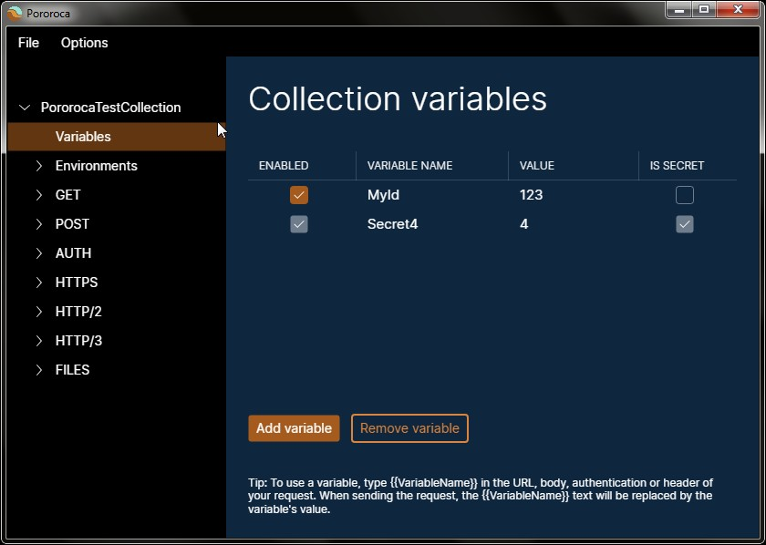
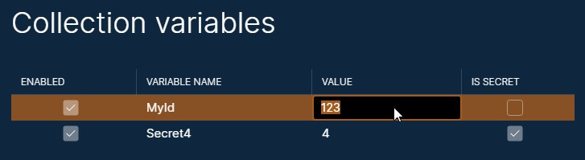
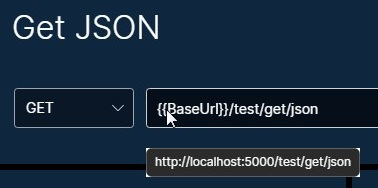
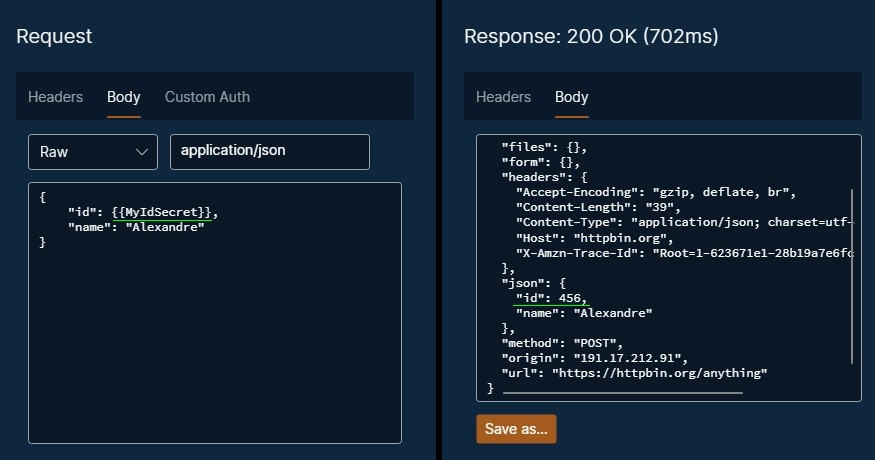

# Variables

A variable is a value that can be applied on certain parameters of a request. Instead of typing the same value repeatedly across many requests, you can use a variable for that, saving effort if you need to change this value - only change the variable's value where it is defined, in a single place.

There are two classes of variables: collection variables and environment variables.

## Collection variables

Collection variables are available to be used in every request of the collection. To view the collection variables, click on the collection "Variables" in the left panel.

## Environment variables

Environment variables are also available for every request of the collection, however, they will only be considered for usage if the environment is active / current. To view the environment variables, click on the environment in the left panel.

## Editing variables

You can add a new variable by clicking on the "Add Variable" button. To edit a variable, double-click a field of the variable in the variables grid and enter text.

To remove a variable, click on it in the variables grid, then click on the "Remove Variable" button.

A variable can be enabled or disabled. Only enabled variables will be considered for value resolution.

Variables marked as secret allow for better control of sensitive data when exporting your collection or environment. Read more on the [Export and Import](ExportAndImport.md) page.

## How to use a variable

Variables can be used for the following fields of a request:
* URL
* HTTP headers' names and values
* Custom auth parameters
* Body
    * Raw body: content
    * File body: file source path
    * Form URL encoded body: parameters' names and values
    * Multipart form data body: parameters' names and values, including file source paths

To use a variable, type `{{VariableName}}` on the field you want to apply it, where `VariableName` is the declared variable's name.

For example: if a request URL is `{{BaseUrl}}/index.html` and there is a variable named `BaseUrl` with the value `http://www.pudim.com.br`, when sending the request, the resolved URL will be `http://www.pudim.com.br/index.html`.

For request URLs, you can hover over the URL text box and preview the resolved URL.

The image below shows how to use a variable in a raw body's content.

## Variable resolution logic

The resolution logic is as follows:
* Collection variables will be merged with the current environment variables. If no environment is active, then only collection variables will be considered.
* Also, only enabled variables are considered.
* Environment variables have higher importance than collection variables. If there are two variables declared with the same name both in the collection and in the environment, the environment variable will be the chosen one.
* Every request field that allows the usage of variables will be checked for whether it has a variable template, for example, `{{VARIABLE_NAME}}`. If the template is found and there is an enabled variable for it, the variable's value will be applied. Otherwise, the template will remain in the text field.