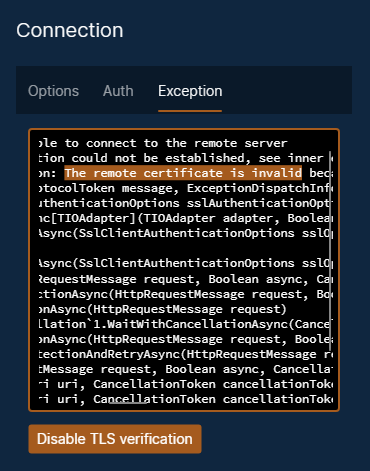
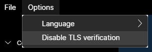
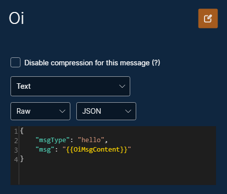
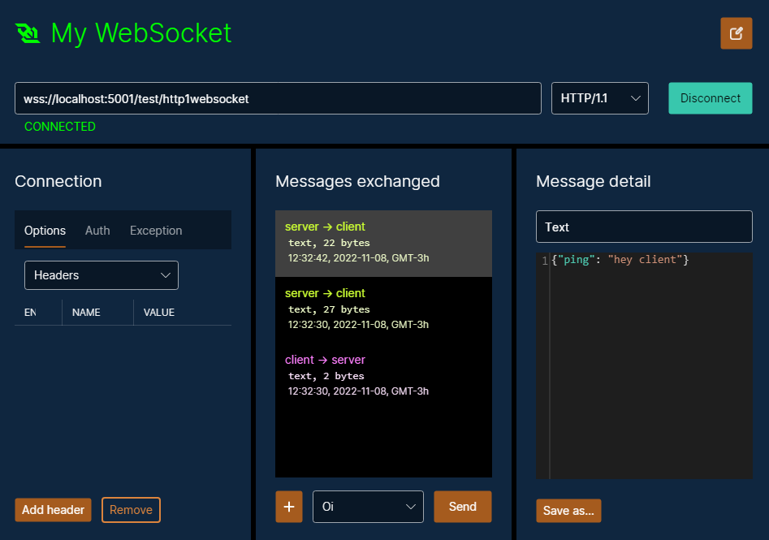

# WebSockets

* [General aspects](#general-aspects)
* [Creating](#creating)
* [Renaming](#renaming)
* [Connection options](#connection-options)
* [TLS / SSL server certificate verification](#tls--ssl-server-certificate-verification)
* [Client messages](#client-messages)
* [Exchanging messages](#exchanging-messages)

## General aspects

The WebSocket is a communication protocol that operates over HTTP, with an important difference: WebSockets allows bidirectional communication.

A regular HTTP call is a "ping-pong", that is, a request that receives a response. In a WebSocket, the server can send many messages without needing a request, and similarly, the client can send many messages without hoping for responses.

## Creating

You can create a WebSocket connection in a collection or in a folder, by clicking on the "Add WebSocket" button or by right-clicking in the left panel.

## Renaming

To rename, click on the pencil icon, at the top right. This will enable the connection name for edition.

## Connection options

The first panel, from left to right, configures the HTTP request that connects the WebSocket to the server.

The headers and authentication can be configured in the same way as for [HTTP requests](./HttpRequests.md).

In this same panel, the subprotocols and compression options can be defined.

The Exception tab shows what connection error happened, if any.

## TLS / SSL server certificate verification

By default, Pororoca verifies server SSL / TLS certificates on HTTPS connections, and if there are any validation failures, the request will not go forward, like in the picture below.

To disable server TLS certificate check, click on the button on the bottom, or go to the top menu, "Options", and select "Disable TLS verification".

## Client messages

The client messages are the ones that you can send to the server. To create a new client message, click on the "+" button in the middle panel, or right-click the WebSocket in the left panel, and select "New client message".

There are three types of WebSocket messages: *text*, *binary* and *closing message*. In Pororoca, the messages' content can be passed as text (raw) or as a file.

Just like in HTTP requests, you can use [variables](./Variables.md) in text or to specify the file path.

## Exchanging messages

After clicking on the "Connect" button, the title and icon of the WebSocket will become green, indicating that it is connected.

The middle panel shows the conversation between the client and server.

To see a message's details, click on it and its content will appear on the right panel. You can save this message to a file, by clicking on the "Save as…" button.

