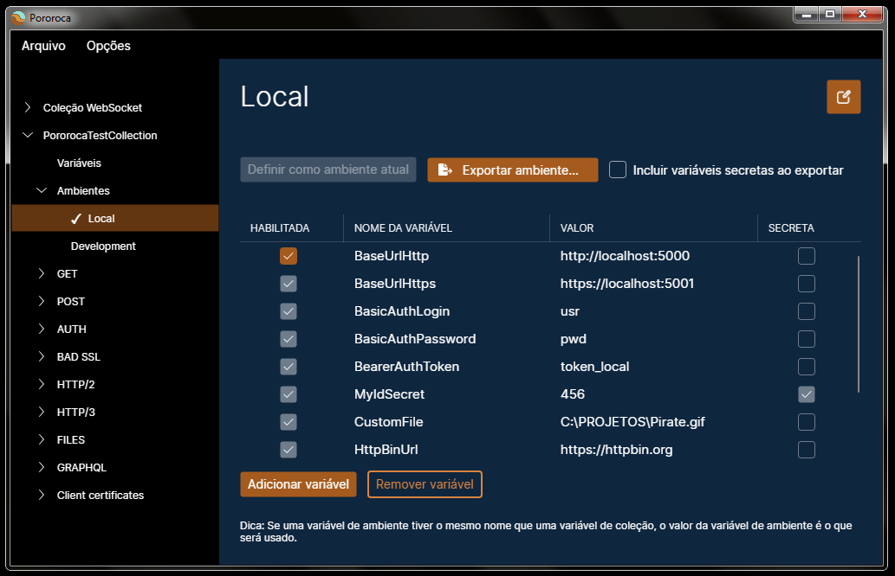

# Ambientes

Um ambiente é um grupo de [variáveis](Variáveis.md).

O termo ambiente vem do fato de que a maioria dos serviços Web são replicados entre diferentes ambientes, como um ambiente Local, para uma aplicação rodando na mesma máquina; um ambiente de Desenvolvimento, usado por desenvolvedores; um ambiente de QA, usado por testadores; um ambiente de Homologação, para testes de terceiros; e finalmente, o ambiente de Produção, que os consumidores finais usam e, portanto, é o que necessita de maior cuidado ao usá-lo ou fazer mudanças nele.

Esse exemplo de conjunto de ambientes é comum em sistemas importantes e permite maior independência e segurança - uma nova versão de uma API pode ser primeiro publicada em um ambiente de Desenvolvimento e ser testada nele; se um bug ou defeito for detectado nessa nova versão, não afetará os consumidores finais, porque essa nova versão não foi publicada no ambiente usado por eles, o ambiente de Produção. Há mais informações sobre isso [aqui](https://pt.wikipedia.org/wiki/Ambiente_de_implanta%C3%A7%C3%A3o).

Ambientes não são obrigatórios para fazer requisições. Porém, podem ajudar muito no gerenciamento e em testes.

## Criando

Para criar um ambiente, expanda a coleção no painel esquerdo e clique com o botão direito do mouse em "Ambientes", depois em "Novo ambiente". Você também pode fazer isso na tela de coleção.

Seu novo ambiente estará dentro de "Ambientes". Você pode criar quantos ambientes quiser.

## Renomeando

Para renomear seu ambiente, clique no botão com um lápis, no canto superior direito. Isso habilitará para edição o nome do ambiente.

## Importar e exportar

Ambientes podem ser exportados e importados para / de arquivos. Confira na página [Exportar e Importar](ExportarEImportar.md).

## Escolhendo um ambiente

Apenas um ambiente pode estar ativo em uma coleção e apenas quando o ambiente estiver ativo suas variáveis estarão disponíveis para serem aplicadas. Para escolher um ambiente, clique com o botão direito do mouse nele no painel esquerdo e selecione "Definir como ambiente atual".

## Comparação com ambientes do Postman

O Postman também tem ambientes, que também são grupos de variáveis. A principal diferença é que um ambiente do Postman tem escopo global, com suas variáveis valendo para todas as coleções. No Pororoca, um ambiente tem escopo de coleção, para serem exportados junto com a coleção e para não haver risco de usar um ambiente no lugar errado.