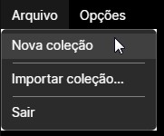

# Coleções

Uma coleção do Pororoca armazena as suas variáveis de coleção, seus ambientes e requisições HTTP, juntos em um único lugar.

## Criando

Para criar uma nova coleção, vá ao menu superior, selecione "Arquivo", depois "Nova coleção". A nova coleção vai aparecer no painel esquerdo. Você pode criar quantas coleções quiser.

## Renomeando

Para renomear sua coleção, clique na coleção no painel esquerdo, depois, na tela principal, clique no botão com um lápis, no canto superior direito. Isso habilitará para edição o nome da coleção. Depois de mudar, clique no ícone de check para aplicar o novo nome.

## Importar e exportar

Coleções também podem ser exportadas e importadas para / de arquivos. Confira a página [Exportar e Importar](ExportarEImportar.md).

## Local de armazenamento

As coleções criadas ficam salvas na pasta `PororocaUserData`, junto ao programa executável. Ao encerrar o programa, todas as coleções são salvas.