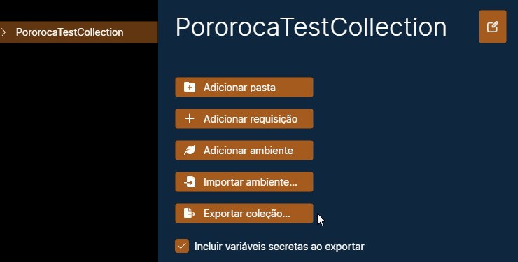
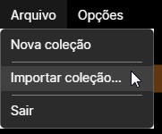
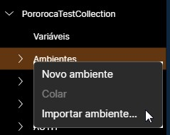

# Exportar e Importar

Coleções e ambientes podem ser exportados e importados para / de arquivos, que podem ser salvos e compartilhados com outras pessoas.

Pororoca oferece compatibilidade total de exportação e importação com o Postman.

## Exportar

Para exportar uma coleção ou um ambiente, clique neles no painel da esquerda, depois clique em um dos botões "Exportar como...", dependendo do tipo de formato que desejar.

A opção "Incluir variáveis secretas", se selecionada, incluirá os valores de variáveis secretas nos arquivos exportados. Se não estiver selecionada, os valores das variáveis secretas serão substituídos por um texto em branco.

Ao exportar uma coleção em formato Pororoca, os ambientes da coleção também serão transportados no arquivo - não há necessidade de exportar cada ambiente individualmente.

Os arquivos exportados são arquivos textos em formato JSON, que podem ser inspecionados e editados em um edito de texto de sua escolha.

## Importar

### Coleção

Para importar uma coleção, vá ao menu superior, selecione "Arquivo", depois "Importar coleção...". Uma janela de seleção de arquivo se abrirá.

*Nota*: Requisições do Postman que usam parâmetros arquivo usam um esquema diferente de caminho de arquivos do que o Pororoca usa. Após a importação, confira se os caminhos de arquivos estão corretos, por exemplo, nos corpos das requisições.

### Ambiente

Para importar um ambiente, expanda sua coleção no painel esquerdo e clique com o botão direito do mouse em "Ambientes". Depois, selecione "Importar ambiente...". Uma janela de seleção de arquivo se abrirá.

