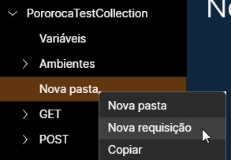
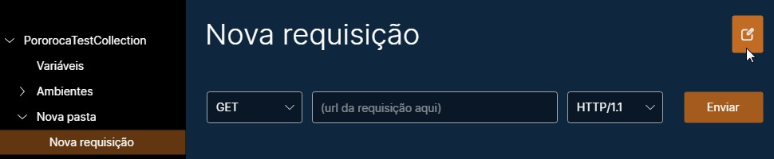
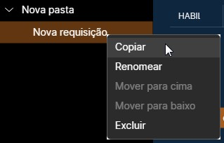
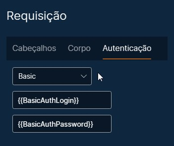
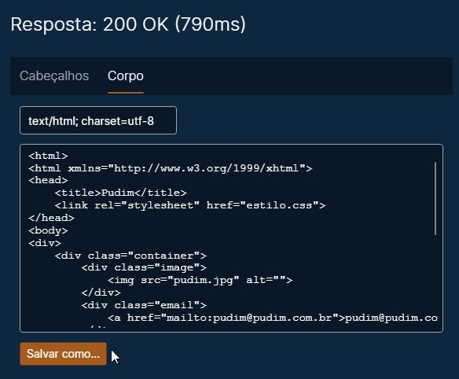
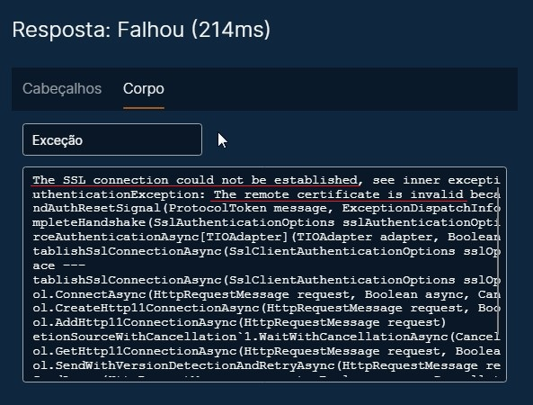
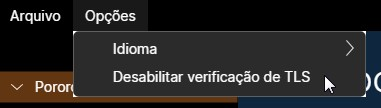

# Requisições

Uma requisição HTTP é composta por:
* Método / verbo HTTP
* URL da requisição
* Versão do HTTP
* Cabeçalhos (opcionais)
* Corpo (opcional)
  
Uma resposta HTTP contém:
* Versão do HTTP
* Código de status HTTP
* Cabeçalhos (opcionais)
* Corpo (opcional)

## Criando

Para criar uma nova requisição, clique com o botão direito do mouse em uma coleção ou pasta e selecione "Nova requisição". A nova requisição estará visível e você pode criar quantas requisições quiser.

## Renomeando

Para renomear sua requisição, clique nela no painel esquerdo, depois, na tela principal, clique no ícone de lápis, no canto superior direito. Isso vai liberar para edição o nome da requisição. Depois de mudar, clique no ícone de check para aplicar o novo nome.

## Copiando, colando e excluindo

Para copiar uma requisição, clique com o botão direito do mouse nela no painel esquerdo e selecione "Copiar". Depois, clique com o botão direito do mouse em uma coleção ou pasta e selecione "Colar".

Para excluir uma requisição, clique com o botão direito nela, "Excluir".

Você pode selecionar mais de uma requisição ou pasta ao mesmo tempo e copiá-las ou excluí-las juntas.

"Mover para cima" e "Mover para baixo" mudam a ordem das requisições dentro de uma coleção ou pasta.

## Autenticação customizada

Autenticação customizada permite que você insira valores de autenticação, ao invés de digitar manualmente um header Authorization. Dois tipos de autenticação são oferecidos: Basic e Bearer.

### Autenticação Basic

Se autenticação Basic for usada, com um login "usr" e com uma senha "pwd", o seguinte header Authorization será adicionado na requisição enviada, de acordo com a [lógica de Basic Authentication](https://browse-tutorials.com/tools/basic-auth):

`Authorization: Basic dXNyOnB3ZA==`

### Autenticação Bearer

Se autenticação Bearer for usada, com um bearer token "my_token", então o seguinte header Authorization será adicionado na requisição enviada:

`Authorization: Bearer my_token`

### Autenticação por certificado de cliente

A autenticação por certificado de cliente difere dos métodos acima porque opera na camada de TLS, antes da requisição HTTP ser transmitida.

Os dois tipos aceitos de certificados de cliente são o PKCS#12 e o PEM. Esta [página](https://www.ryadel.com/en/ssl-certificates-standards-formats-extensions-cer-crt-key-pfx-pem-p7b-p7c-pfx-p12/?msclkid=ca7bc065ae0311ec98e66e2041811628) detalha alguns dos tipos de certificados que existem.

## Enviando uma requisição

Para enviar uma requisição, clique no botão "Enviar", no canto superior direito da tela. Você pode abortar a requisição clicando no botão "Cancelar". O tempo de timeout é de 5 minutos.

Você pode salvar o corpo da resposta em um arquivo, clicando no botão "Salvar como...".

## Verificação de certificado SSL / TLS do servidor

Por padrão, o Pororoca realiza uma verificação de certificado SSL / TLS do servidor em conexões com HTTPS e, se houver uma falha na validação, a requisição não prosseguirá, como na figura abaixo.

Para desabilitar a verificação de certificado TLS do servidor, vá ao menu superior, em "Opções", e selecione "Desabilitar verificação de TLS".

