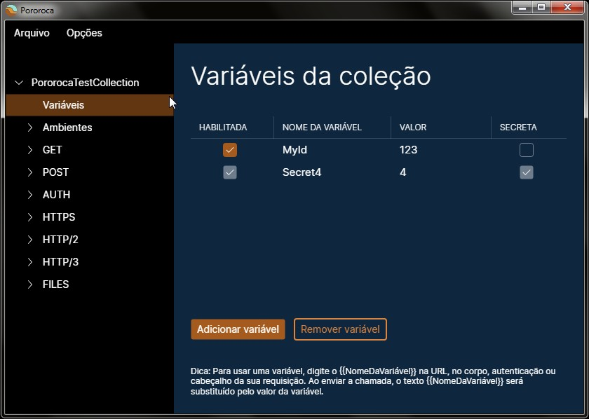
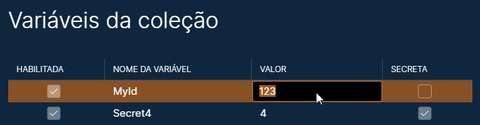
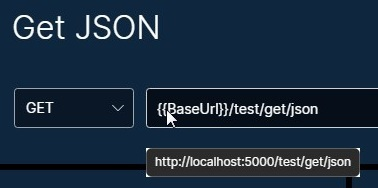
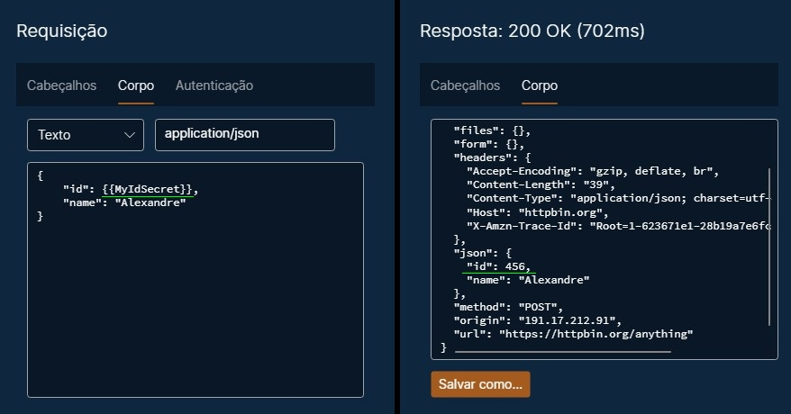

# Variáveis

Uma variável é um valor que pode ser aplicado em certos parâmetros de uma requisição. Ao invés de digitar o mesmo valor repetidamente em várias requisições, você pode usar uma variável para isso, poupando esforço se precisar mudar esse valor - apenas mude o valor da variável onde é definido, em um único lugar.

Há duas classes de variáveis: variáveis de coleção e variáveis de ambiente.

## Variáveis de coleção

Variáveis de coleção ficam disponíveis para todas as requisições de uma coleção. Para ver as variáveis de uma coleção, clique na seção "Variáveis" de uma coleção, no painel esquerdo.

## Variáveis de ambiente

Variáveis de ambiente também ficam disponíveis para todas as requisições de uma coleção; contudo, elas apenas serão consideradas para uso se o ambiente for o ambiente atual / ativo. Para ver as variáveis de ambiente, clique no ambiente, no painel esquerdo.

## Editando variáveis

Você pode adicionar uma nova variável clicando no botão "Adicionar variável". Para editar uma variável, dê um duplo-clique em um campo da variável na matriz de variáveis e digite texto.

Para remover uma variável, clique nela na matriz de variáveis, depois clique no botão "Remover variável".

Uma variável pode estar habilitada ou desabilitada. Apenas variáveis habilitadas serão consideradas para uma resolução de valor.

Variáveis marcadas como secretas permitem uma melhor controle de dados sensíveis ao exportar sua coleção ou ambiente. Leia mais na página [Exportar e Importar](ExportarEImportar.md).

## Como usar uma variável

Variáveis podem ser usadas nos seguintes campos de uma requisição:
* URL
* Nomes e valores de cabeçalhos HTTP
* Valores de autenticação
* Corpo
    * Corpo-texto: conteúdo
    * Corpo-arquivo: caminho do arquivo
    * Corpo form URL encoded: nomes e valores dos parâmetros
    * Corpo multipart form data: nomes e valores dos parâmetros, incluindo caminhos de arquivos
    * Corpo GraphQL: conteúdo do campo variáveis

Para usar uma variável, digite `{{NomeDaVariável}}` no campo onde deseja aplicá-la, sendo que `NomeDaVariável` é o nome da variável declarada.

Por exemplo: se a URL de uma requisição for `{{BaseUrl}}/index.html` e houver um variável de nome `BaseUrl` e valor `http://www.pudim.com.br`, ao enviar a requisição, o valor resolvido da URL será `http://www.pudim.com.br/index.html`.

Para URLs de requisições, você pode passar o mouse em cima da caixa de texto da URL para prever a URL resolvida.

A imagem abaixo mostra como usar uma variável em um corpo-texto.

## Lógica de resolução de variáveis

A lógica de resolução é:

* Variáveis de coleção serão juntadas com as variáveis do ambiente atual. Se não houver ambiente atual, apenas variáveis de coleção serão consideradas.
* Além disso, apenas variáveis habilitadas serão consideradas.
* Variáveis de ambiente têm predominância sobre variáveis de coleção. Se houver duas variáveis declaradas com o mesmo nome na coleção e no ambiente, a variável do ambiente será a escolhida.
* Todo campo de requisição que permite uso de variáveis será analisado para verificar se ele tem um molde (template) de variável, como por exemplo, `{{NOME_DA_VARIÁVEL}}`. Se um molde for encontrado e houver uma variável habilitada para ele, o molde será trocado pelo valor da variável. Caso contrário, o texto do molde continuará no lugar.