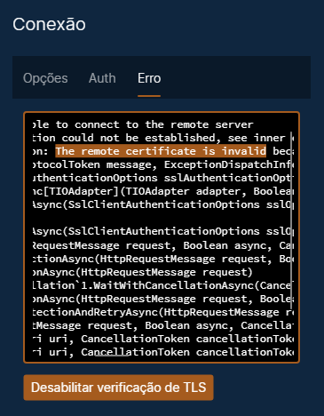
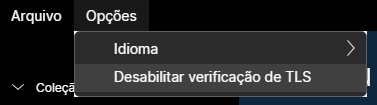
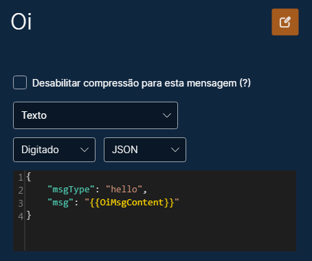
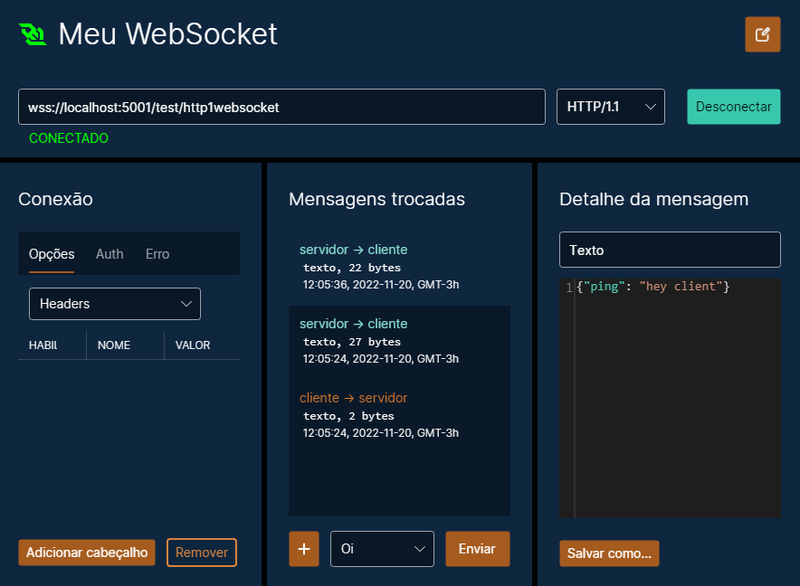

# WebSockets

* [Aspectos gerais](#aspectos-gerais)
* [Criando](#criando)
* [Renomeando](#renomeando)
* [Opções de conexão](#opções-de-conexão)
* [Verificação de certificado SSL / TLS do servidor](#verificação-de-certificado-ssl--tls-do-servidor)
* [Mensagens de cliente](#mensagens-de-cliente)
* [Trocando mensagens](#trocando-mensagens)

## Aspectos gerais

O WebSocket é um protocolo de comunicação que funciona sobre o HTTP, com uma importante diferença: o WebSocket permite comunicação bidirecional.

Uma chamada HTTP comum é um "ping-pong", isto é, uma requisição que recebe uma resposta. No WebSocket, o servidor pode mandar várias mensagens sem precisar de uma requisição, e do mesmo modo, o cliente pode enviar várias mensagens sem esperar respostas.

## Criando

Você pode criar uma conexão WebSocket em uma coleção ou em uma pasta, clicando no botão "Novo WebSocket" ou clicando com o botão direito do mouse no painel da esquerda.

## Renomeando

Para renomear, clique no botão com um lápis, no canto superior direito. Isso habilitará para edição o nome do ambiente.

## Opções de conexão

O primeiro painel, da esquerda para a direita, configura a requisição HTTP que faz a conexão WebSocket com o servidor.

Os cabeçalhos e a autenticação podem ser configurados da mesma forma como são para as [requisições HTTP](./Requisi%C3%A7%C3%B5esHttp.md).

Nesse mesmo painel, também podem ser definidos os subprotocolos e a compressão usada na conexão.

A aba Erro mostra qual foi o erro de conexão que houve, se ocorreu.

## Verificação de certificado SSL / TLS do servidor

Por padrão, o Pororoca realiza uma verificação de certificado SSL / TLS do servidor em conexões com HTTPS e, se houver uma falha na validação, a requisição não prosseguirá, como na figura abaixo.

Para desabilitar a verificação de certificado TLS do servidor, clique no botão que fica na parte de baixo, ou vá ao menu superior, em "Opções", e selecione "Desabilitar verificação de TLS".

## Mensagens de cliente

As mensagens de cliente são as que você pode enviar para o servidor. Para criar uma nova mensagem de cliente, clique no botão "+" no painel do meio, ou então clique com o botão direito do mouse no WebSocket, no painel da esquerda, e selecione "Nova mensagem de cliente".

Existem três tipos de mensagens WebSocket: *texto*, *binário* e *encerramento de conexão*. No Pororoca, o conteúdo dessas mensagens pode ser passado como texto ou via arquivo.

Assim como em requisições HTTP, você pode usar [variáveis](./Vari%C3%A1veis.md) no texto ou para especificar o caminho do arquivo.

## Trocando mensagens

Após clicar no botão "Conectar", o título e o ícone do WebSocket ficarão verdes, indicando que a conexão está ativa.

O painel do meio mostra a conversa de mensagens entre o cliente e o servidor.

Para ver uma mensagem em detalhe, clique nela e seu conteúdo aparecerá no painel da direita. Você pode salvar essa mensagem em um arquivo, clicando no botão "Salvar como…".

