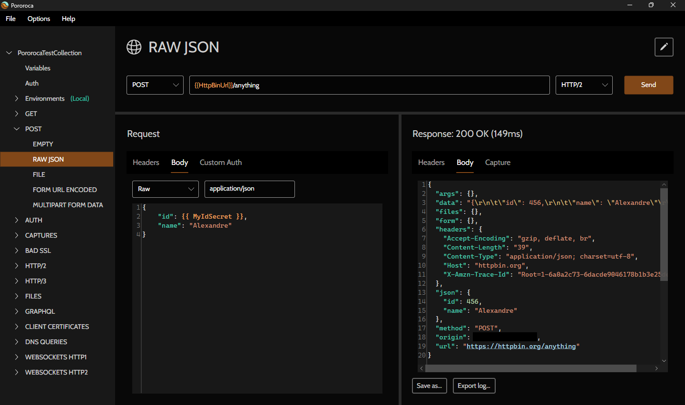

<h1>Pororoca </h1>

Leggi in: [english](../README.md) | [português](README_pt.md) | [русском](README_ru.md) | [中文](README_zh-cn.md) | [Deutsch](README_de.md) | [español](README_es.md) | [polski](README_pl.md) | [ไทย](README_th.md)

Pororoca è uno strumento di test HTTP, ispirato a Postman, ma con molti miglioramenti.

È disponibile per Windows, macOS e Linux.

## Installazione

Leggi le [istruzioni](https://pororoca.io/docs/installation) e scarica il programma [qui](https://github.com/alexandrehtrb/Pororoca/releases).

## Funzionalità

* Supporto per [HTTP/2](https://http2.github.io/) e [HTTP/3](https://developers.cloudflare.com/http3/).
* Ambienti con ambito di collezione.
* Facile gestione delle variabili.
* Variabili segrete.
* Le collezioni e gli ambienti possono essere esportati insieme in un unico file.
* Piena compatibilità di esportazione e importazione con Postman.
* Utilizzo della memoria molto inferiore, da due a tre volte inferiore rispetto a Postman.
* Supporto multilingua.
* Test automatizzati.
* WebSockets.
* Tempo di avvio rapido.
* Gratuito e open-source.

Consulta la [documentazione](https://pororoca.io/docs/) per saperne di più.

*Nota*: su Windows, il supporto per HTTP/2 richiede Windows 10 o versioni successive. Il supporto per HTTP/3 richiede Linux o Windows 11 e versioni successive.

### HTTP/2 e HTTP/3

Vuoi saperne di più su HTTP/2 e HTTP/3? Dai un'occhiata a questo [articolo](https://alexandrehtrb.github.io/posts/2024/03/http2-and-http3-explained/).

## Politica di protezione dei dati

Pororoca non sincronizza i dati dell'utente, come preferenze, collezione, ambienti, informazioni sulla macchina o telemetria, su alcun server remoto. Le preferenze e le collezione dell'utente vengono salvate come file nel computer dell'utente.

## Design

Logo e grafica creati da [Anderson Martins](https://www.behance.net/am-dsgn).

## Contribuire

È possibile contribuire a questo progetto inviando pull request, aprendo problemi, segnalando bug e suggerendo miglioramenti. Racconta di Pororoca ai tuoi amici se ti piace!

Leggi il tutorial per i contributi al codice e lo sviluppo [qui](CONTRIBUTING.md).

Contattaci se stai cercando un supporto più avanzato, personalizzazioni speciali o formazione.

## Donazioni

Le donazioni in denaro sono molto importanti e ci aiutano a coprire le nostre spese. Scopri di più nel nostro [annuncio](https://github.com/alexandrehtrb/Pororoca/discussions/159)!

I nostri canali di donazione sono:

- [OpenCollective](https://opencollective.com/pororoca)
- [GitHub Sponsors](https://github.com/sponsors/alexandrehtrb)
- [Wise](https://wise.com/pay/me/alexandrehenriquet2) (tag: **@alexandrehenriquet2**)
- PIX 🇧🇷 (chave: <b>alexandrehtrb@outlook.com</b>)

## Contatto

* Creatore: Alexandre H. T. R. Bonfitto
* E-mail: <a href="mailto:%61%6C%65%78%61%6E%64%72%65%68%74%72%62%40%6F%75%74%6C%6F%6F%6B%2E%63%6F%6D" target="_blank" rel="noreferrer">alexandrehtrb@outlook.com</a>
